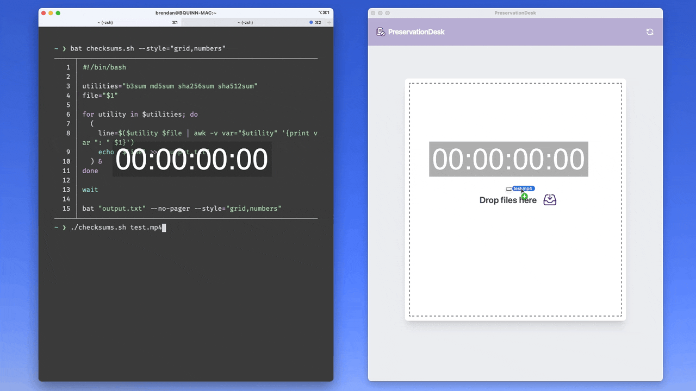

<h1 align="center">
  
   PreservationDesk 
</h1>

> **Disclaimer**: PreservationDesk is an early-stage research project intended for educational and informational purposes and should be used at your own risk. _You may encounter bugs in the software_

## What is PreservationDesk?

PreservationDesk is a cross-platform application for extracting digital preservation information from your files. Drag and drop files into the application and PreservationDesk will present each file's [size](https://en.wikipedia.org/wiki/File_size), [MIME type](https://en.wikipedia.org/wiki/Media_type), and values for several [cryptographic hash algorithms](https://en.wikipedia.org/wiki/Cryptographic_hash_function#Cryptographic_hash_algorithms)

## Performance

Below is a demonstration comparing the speed difference between PreservationDesk and a bash script that calculates each checksum in a subprocess for a 1.5GB file:

## Development

### Get started

1. Install [Tauri prerequisites](https://tauri.app/v1/guides/getting-started/prerequisites)
2. Follow the [Tauri setup guide](https://tauri.studio/en/docs/getting-started/intro)
3. Run `npm install`

### Commands

- `npm run dev`: Start app in dev mode
- `npm run build`: Build
- `npm run lint`: Lint
- `npm run format`: Format

## Attribution

PreservationDesk is built using these incredible [open-source](https://en.wikipedia.org/wiki/Open-source_software) projects:

- [Tauri](https://tauri.app)
- [Tailwind CSS](https://tailwindcss.com)
- [Vite](https://vitejs.dev)
- [TypeScript](https://www.typescriptlang.org)
- [Rust](https://www.rust-lang.org)

### UI Layout inspiration:

- card design:
  - description lists [tailwindui.com](https://tailwindui.com/components/application-ui/data-display/description-lists)
  - close button [tailwindui.com](https://tailwindcomponents.com/component/close-btn)
- header design: responsive header [tailwindcss.com](https://v1.tailwindcss.com/components/navigation#responsive-header)
- icons: [heroicons.dev](https://heroicons.dev)
- confetti effect: [js-confetti](https://github.com/loonywizard/js-confetti)
